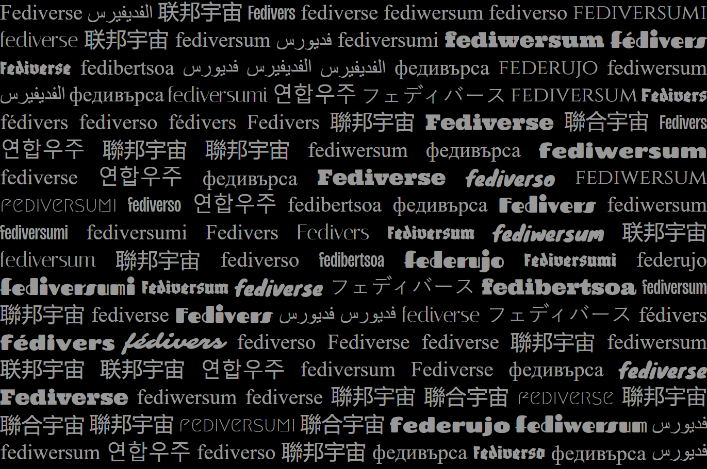

[](https://github.com/jointhefediverse-net/jointhefediverse.net/tree/main/public/images/fediverse.png)

# Fediverse Invitation

A semi-customizable invitation page that lets you choose a serve and pick from a variety of popular fediverse apps.

### Development

This project uses node v22.16.0. Here's how you can run it locally:

```sh
#install dependencies
npm install

# start development server
npm run dev
```
