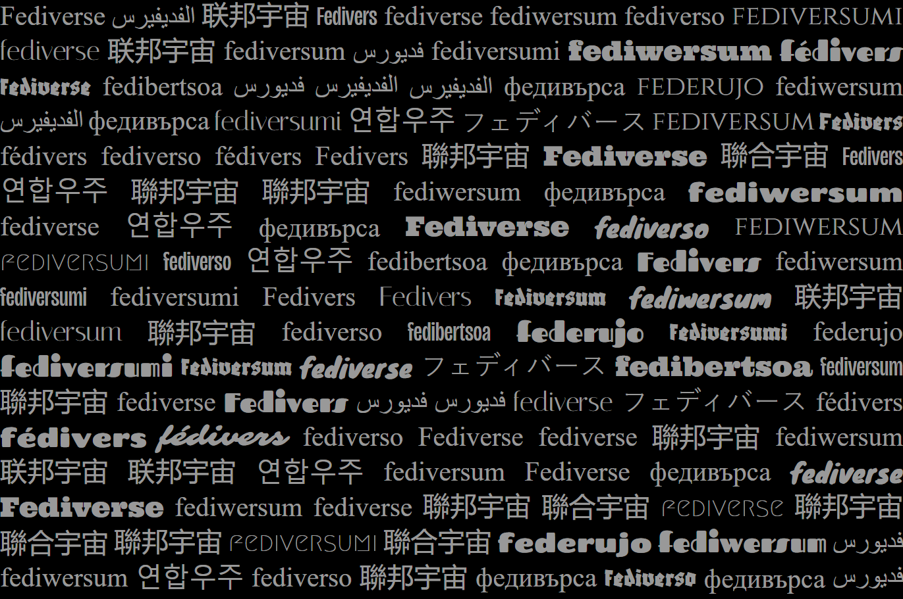

[](https://github.com/stefanbohacek/fediverse-invite/tree/main/public/images/fediverse.png)

# Fediverse Invitation

A semi-customizable invitation page that lets you choose a serve and pick from a variety of popular fediverse apps. (See the full list [here](https://github.com/stefanbohacek/fediverse-invite/blob/main/data/apps.json).)

## Contributing

This project is run by volunteers and we appreciate all help. Here's how you can contribute.

### Translation

Before you begin translating the site:

- See [which languages are already available](https://github.com/stefanbohacek/fediverse-invite/tree/main/translations) (see also the [About page](https://invite.jointhefediverse.net/about)).
- Check if someone is [already working on a translation into your language](https://github.com/stefanbohacek/fediverse-invite/issues?q=is%3Aopen+is%3Aissue+sort%3Aupdated-desc+label%3Atranslation).
- If there is an open ticket with your language, feel free to leave a comment if you'd like to join in.
- You can [open a new issue](https://github.com/stefanbohacek/fediverse-invite/issues/new?assignees=&labels=translation&projects=&template=translation.md&title=Translation%3A+LANGUAGE+NAME+%28language-code%29) titled `Translation: LANGUAGE NAME (language code)` (Here's a [helpful list of language codes](https://www.andiamo.co.uk/resources/iso-language-codes/ ).), or [reach out privately](https://stefanbohacek.com/contact/) and a ticket to track your work will be created for you.

The current translation workflow is described below. If you don't have a GitHub account, or prefer not to use it, feel free to follow steps 1 through 4 and send the translated files [via email](https://stefanbohacek.com/contact/).

Otherwise, you can [fork this repo](https://docs.github.com/en/get-started/quickstart/fork-a-repo), make the necessary changes, and open a pull request.

1. Note the [language code](https://www.ibm.com/docs/en/datacap/9.1.8?topic=support-supported-language-codes) for the language you'd like to translate. This will be your "locale".
2. Navigate to the `translations` folder.
3. Make a copy of the `en-us` folder and rename it to match your locale, in lower case.
4. Update the `.json` files inside the new folder.

The `[locale].json` file should have the following format:

```js
{
    "label": "Native name of the language",
    "label_lat": "latinized native name of the language, this is used for sorting",
    "label_en": "English name of the language",
    "lang_dir": "the direction of the languaue, LTR (left-to-right) or RTL (right-to-left)",
    "available": true, // Should the language be visible in the language picker? true or false
    "translators": [ // List of people who contributed to the translation
        {
            "name": "Person A",
            "url": "https://example.social/@person_a"
        },
        {
            "name": "Person B",
            "url": "https://example.social/@person_b"
        }
    ]
}
```

Please note that `label_lat` should be a latinized (or transliterated) version of the English name of the language. This is needed for a more natural alphabetical sorting in the language picker menu. For example, for Spanish:

```json
"label": "Español",
"label_lat": "espanol",
"label_en": "Spanish",
```

Also, please note that `//` and the following text used in the example above should not be included in the translated JSON file, this is only used for explanation.

5. Translate each file inside your locale folder.

If you're working with a local copy of the site, you will need to [install node](https://nodejs.org/en/download) and run `npm run translate` to compile  translation files inside the `locales` directory. These files are not committed to the repo and will be generated during site deployment. 

Keep in mind that the goal is to [communicate the same ideas to an audience in a different culture](https://localizejs.com/articles/what-is-the-difference-between-translation-and-localization/).

### Updating existing translations

If you'd like to suggest changes to existing translations, and you're comfortable using git/GitHub, you can open a pull request with edits to the [translated files for your particular language](https://github.com/stefanbohacek/fediverse-invite/tree/main/translations).

Otherwise, please [reach out with your suggestions](https://stefanbohacek.com/contact/).

### Development

This project uses node v22.16.0. Here's how you can run it locally:

```sh
#install dependencies
npm install

# start development server
npm run dev
```

## License

Shield: [![CC BY 4.0][cc-by-shield]][cc-by]

This work is licensed under a
[Creative Commons Attribution 4.0 International License][cc-by].

[![CC BY 4.0][cc-by-image]][cc-by]

[cc-by]: http://creativecommons.org/licenses/by/4.0/
[cc-by-image]: https://i.creativecommons.org/l/by/4.0/88x31.png
[cc-by-shield]: https://img.shields.io/badge/License-CC%20BY%204.0-lightgrey.svg